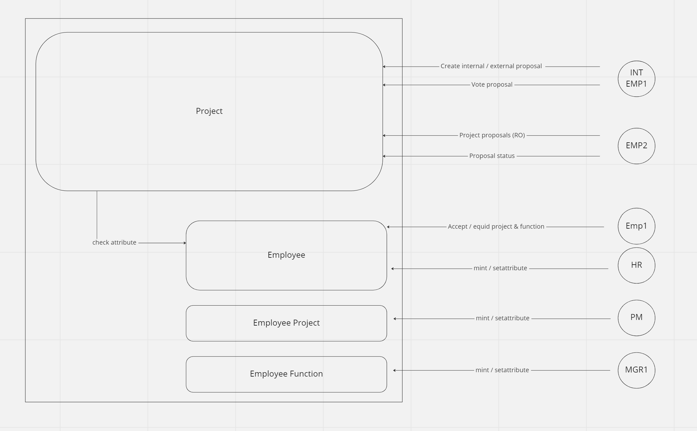
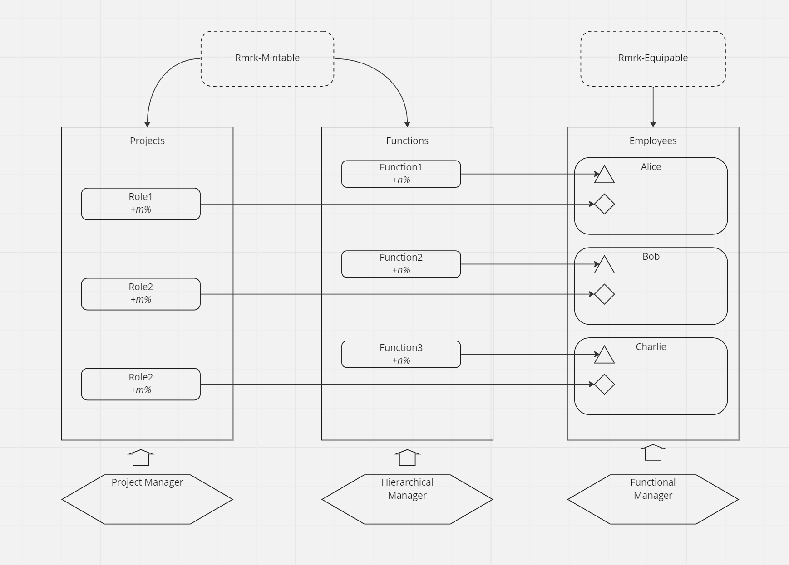
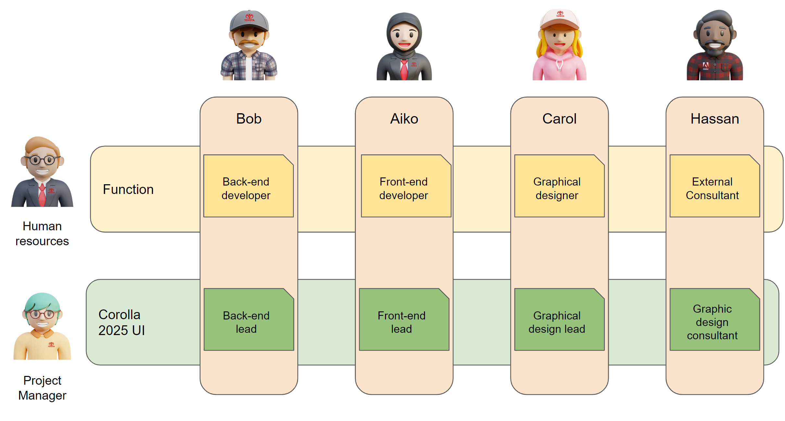
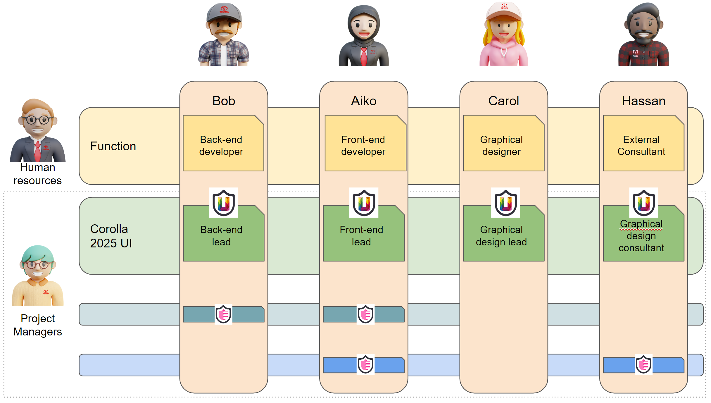

# Toyota Hackathon Submission 
This repo is for the submission of the Toyota and Astar Hackathon.

## Hackathon Abstract:

Toyota is on a mission to continue the Kaizen culture at their workplace, in the form of a DAO. The purpose of this project is as follows: 

- Manage projects as a DAO and introduce the DAO concept to the company and the employees 
- Reduce the manager’s workload 
- Decentralize decision-making and management tasks and aim for an organization in which employees of Toyota can act more autonomously
- The product should facilitate team formation, issuance of governance tokens, voting, etc.
- Help team members improve the impact that they have on company growth

## Ok-Alice Project Summary:

Our system streamlines Toyota's project management by using DAOs and NFTs, reducing the workload for managers. Employees are issued a unique Toyota NFT that serves as their avatar and ID throughout their career. Project attribute NFTs are given to employees working on new projects, granting them access to the project DAO and assigning a team role with corresponding voting power. The historical project NFTs of each team member track their entire working experience and provide additional voting power. This approach ensures that team roles and experience, rather than governance tokens, determine voting power. 

The NFTs of employees evolve according to their contributions to projects, visually representing their commitment over time. 

In this hackathon, we will focus on a small project to redesign the UI of the Toyota Corolla, managed as a DAO.

## System Design:

Depending on the employee's role, their Toytoa employee NFT can be equipped with various attributes that represent their department, experience, achievements, and position within the company. These attributes will determine which proposals the employees can vote on. 

Additionally, the NFT takes into account the employee's experience and position, granting slightly higher weighted votes to those with more experience or seniority. For example, in our project lead developers receive an extra weight of 10%.
 
The NFT also tracks an employee's past participation in company projects. This experience is factored into their voting power.

The NFT’s we are using for the project are RMRK ink NFTs on Astar. These NFTs are what give us the ability to allow each Toyota employee to equip attributes to it as they participate in projects.  The design of the NFTY and equipable attributes are as follows.

Employee 1 NFT: 
- Toyota NFT:
    - *Project Attribute (i.e. 1 vote)*
        - Voting Power
            - Note: Assigned at the beginning of the project
    - *Participation Attribute* 
        - Tracks your participation in previous projects. If you reach a score of ten then you get an extra voting point.

 

 

 

The idea of the attributes is not to exclude people from voting on proposals, but break people into Toyota projects that have the most specialized knowledge of the project. Our system is also set up, so the project can create proposals that anyone with a Toyota employee NFT can vote on, allowing for cross-functional collaboration when necessary. 

At the conclusion of the project, the members will be rewarded with participation attributes/rewards for creating and voting on proposals. 

## Project Example:

We start the example project in a situation where every Toyota employee already has an NFT.

The project example then takes the following steps:

- Dave, a Manager at Toyota needs work done on the Corolla 2025 UI. To do this work, Dave wants to create a Corolla UI project DAO. 
- Dave outlines the work required by the project team and a few high level milestones that need to be voted on. 
    - Project Scope: the Corolla UI team will consist of 5 Toyota team members: 
        - Back-end developer
        - Front-end developer
        - Graphical designer
        - A Test Driver
            - No specific UI experience, but who knows all current Toyota car models very well and is able to give a user perspective on the project
        - UI Designer 
            - An external UI designer from Adobe who’s invited by Dave to the project DAO
- Dave opens a discussion to gather people who share his vision in the project.  Once he has found the seven project members, he will award them with tokens attributes that allow the members to propose and vote on the Corolla 2025 UI project. He also invites an external member from another company (i.e. Chris from Adobe UI).

- Project Team Outline:
    - Aiko: Front-end Dev
        - Toyota NFT:
            - Project Attribute: Corolla 2025 UI Team
                - Voting Power: 1 
            - Participation Attribute: 3 
                - No additional points
    - Bob: Back-end Dev
        - Toyota NFT:
            - Project Attribute: Corolla 2025 UI Team
                - Voting Power: 1.1
            - Participation Attribute: 5 
                - 0.1 Additional voting power
    - Carol: Designer
        - Toyota NFT:
            - Project Attribute: Corolla 2025 UI Team
                - Voting Power: 1.1
            - Participation Attribute: 4
                - No additional points
    - Eve: Test Driver
        - Toyota NFT:
            - Project Attribute: Corolla 2025 UI Team
                - Voting Power: 1
            - Participation Attribute: 0
                - No additional voting power
     - Hassan: Adobe lead UI developer
        - Toyota NFT:
             - Project Attribute: Corolla 2025 UI Team
                - Voting Power: 1
             - Participation Attribute: 0
                 - 0.2 Additional voting power 

- Now that the team members have been selected, they have autonomy over the project and the proposal process can start 
- Aiko, the front-end developer proposes a high level new approach on how to integrate the previous physical dashboard buttons in the new UI
- Bob, the back-end dev, proposes a slightly different approach from Aiko.
- Each member votes on the proposals with their voting power assigned voting
- The proposal Aiko created wins
- Carol makes a proposal to reposition the buttons in order to eliminate one unnecessary step 
- The proposal is voted on and gets rejected
- Carol creates an updated proposal based on the comments of the rejected proposal 
- The team votes on the updated proposal and it passes 
- Hassan, the Adobe UI designer proposes a different use of image and letters, improving the readability of the screen
- The team votes on the proposal and it passes
- The project is now complete and everyone gets rewarded with a participation attribute
- Now Carol has five participation attributes and gets a small additional voting power in the next project.

 

 

 
 

# Code Deployment

Please check the READMEs in the [frontend](frontend/) and [backend](backend/) folders for instructions on how to use this code.
